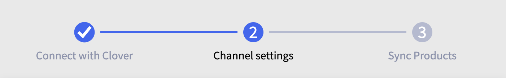
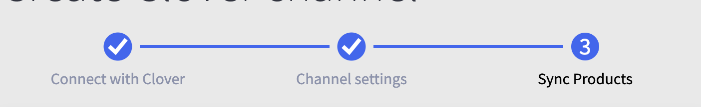

# Steps Progress Bar

## Required use cases for consideration

* ### Visualize progress during multi-step process to onboard Square merchants to Square POS app

* ### Visualize progress during multi-step process to onboard Clover merchants to Clover POS app

* ### Visualize progress during multi-step process to onboard Facebook merchants to Facebook POS app

## Preview
When on the first step

When in an intemediary step

When in the final step


### Sample implementation
```
  const steps = [
    { name: 'First step', content: <h1>This is the first step.</h1>  },
    { name: 'Intermediary step', content: <h2>This is an intermediary step.</h2>},
    { name: 'Final step', content: <p>This is the final step</p> }
  ];

  const [currentStep, setCurrentStep] = useState(0);

  const nextStep = () => setCurrentStep(currentStep+1);
  const previousStep = () => setCurrentStep(currentStep-1);

  return (
    <>
      <ProgressBar steps={steps} currentStep={currentStep} />
      {steps[currentStep]?.content}
      <Button onClick={previousStep}> Previous </Button>
      <Button onClick={nextStep}> Next </Button>
    </>
  );
```

### Details

The Progress Bar was done thinking of the Tabs component in mind, so that the way one pulls this component into a project is already similar.

I wanted to keep the content and the name tied, but all the Progress bar needs on the steps prop is an array of objects with a property 'name' on them, and a number that represents the selected one in currentStep.

All the graphics on the component were done with SVGs that accept colors, and one of them accepts a number (representing the step) to print on screen.

The component's layout was done with grids to align the text easily under each 'step' without any issues of the text bleeding over to another step.